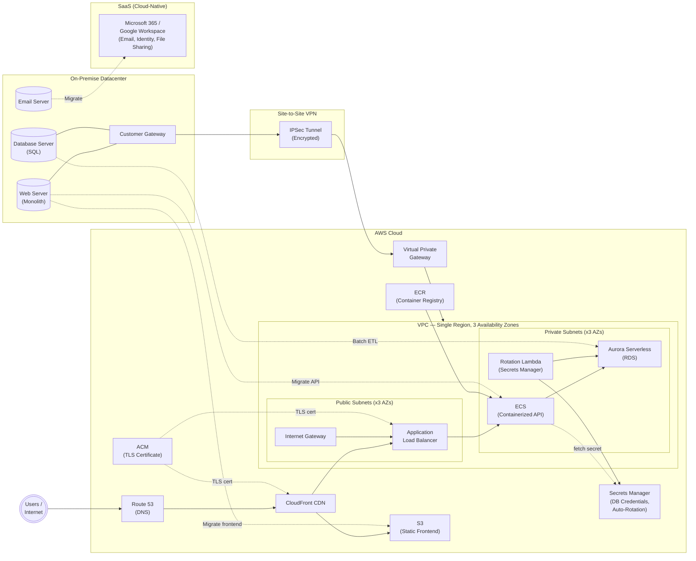

# SMB Cloud Migration — Architecture & Infrastructure

## Terraform Infrastructure

The `terraform/` directory contains modularized Terraform (>= 1.5, AWS provider ~> 5.0, Random provider ~> 3.0) that provisions the full architecture described in this document.

### Module Structure

```
terraform/
  providers.tf          # AWS + Random provider configuration
  variables.tf          # Root input variables
  main.tf               # Module composition, secret version, rotation config, ECS IAM policy
  outputs.tf            # CloudFront URL, ALB DNS, Aurora endpoints, ECR URL, Route 53 NS, ACM ARN, secret ARN
  modules/
    vpc/                # VPC, 3 public + 3 private subnets across 3 AZs, IGW, NAT Gateway, route tables
    vpn/                # Virtual Private Gateway, Customer Gateway, Site-to-Site VPN, BGP route propagation
    ecs/                # ALB, ECS Fargate cluster + service (nginx placeholder), IAM execution role, CloudWatch logs
    aurora/             # Aurora Serverless v2 (PostgreSQL), DB subnet group, security group
    frontend/           # S3 bucket (hello world placeholder), CloudFront OAC, distribution
    ecr/                # ECR private repository, scan-on-push, 30-image lifecycle policy
    route53/            # Public hosted zone for the apex domain
    acm/                # ACM certificate (apex + wildcard SAN), Route 53 DNS validation records
    secrets/            # Random DB password, Secrets Manager secret, PostgreSQL rotation Lambda (SAR)
```

### Security Group Connectivity

| Hop | Source | Destination | Port | Mechanism |
|---|---|---|---|---|
| Internet → ALB | `0.0.0.0/0` | `alb-sg` | 80, 443 | CIDR ingress |
| ALB → ECS tasks | `alb-sg` | `ecs-sg` | 80 (container port) | SG-to-SG reference |
| ECS tasks → Aurora | `ecs-sg` | `aurora-sg` | 5432 | SG-to-SG reference |
| Rotation Lambda → Aurora | `rotation-lambda-sg` | `aurora-sg` | 5432 | SG-to-SG reference |

### Traffic Routing (CloudFront)

| Path | Origin | Caching |
|---|---|---|
| `/*` (default) | S3 static frontend | 24h default TTL |
| `/api/*` | ALB → ECS | Disabled (TTL = 0) |

### Secrets Management

Aurora credentials are generated automatically and stored in AWS Secrets Manager — no password is ever supplied as a Terraform input.

| Secret | Path | Rotation |
|---|---|---|
| Aurora DB credentials | `<project>/db-credentials` | Every 30 days via AWS-managed PostgreSQL rotation Lambda (SAR) |

The secret JSON contains `username`, `password`, `engine`, `host`, `port`, and `dbname`. The rotation Lambda runs inside the VPC (private subnets) and reaches Secrets Manager via the NAT Gateway.

To inject DB credentials into ECS containers, reference the secret ARN from the `db_secret_arn` output in the task definition's `secrets` block:

```json
"secrets": [{ "name": "DB_CREDENTIALS", "valueFrom": "<db_secret_arn>" }]
```

The ECS task execution role is granted `secretsmanager:GetSecretValue` on the DB secret automatically.

### Required Inputs

| Variable | Description |
|---|---|
| `onprem_public_ip` | Public IP of the on-premise customer gateway device |
| `domain_name` | Apex domain for Route 53 hosted zone and ACM certificate (e.g. `example.com`) |

### Deploy

```bash
cd terraform
terraform init
terraform apply \
  -var="onprem_public_ip=<YOUR_IP>" \
  -var="domain_name=example.com"
```

After apply, copy the `route53_name_servers` output to your domain registrar's NS records. ACM validation completes automatically once DNS propagates (typically a few minutes).

### Key Outputs

| Output | Description |
|---|---|
| `cloudfront_domain_name` | Primary public entry point |
| `ecr_repository_url` | ECR URI — use as the image base path in ECS task definitions |
| `acm_certificate_arn` | Validated TLS certificate — attach to CloudFront or ALB HTTPS listeners |
| `route53_name_servers` | NS records to set at your domain registrar |
| `db_secret_arn` | Secrets Manager ARN for DB credentials — reference in ECS task `secrets` block |
| `vpn_customer_gateway_configuration` | (sensitive) XML config for the on-premise customer gateway device |

### Notable Defaults & Upgrade Paths

- **NAT Gateway:** Single instance for cost efficiency. For full HA, provision one per AZ with per-AZ private route tables.
- **VPN routing:** BGP (dynamic). Set `onprem_bgp_asn` and `static_routes_only = false`. For devices without BGP support, switch to `static_routes_only = true` and add `aws_vpn_connection_route` resources.
- **ECS image:** `nginx:latest` placeholder. Replace `container_image` variable with the real application container. Push images to the `ecr_repository_url` output.
- **CloudFront certificate:** Attach the `acm_certificate_arn` output to the CloudFront distribution and set `ssl_support_method = "sni-only"` to enable HTTPS on the custom domain.
- **Aurora:** 2 instances (`db.serverless`) across AZs for Multi-AZ HA. Scales between 0.5–16 ACUs automatically.
- **Secret rotation:** Credentials rotate every 30 days. Adjust `rotation_days` in the secrets module if a shorter cycle is required.

---

## Architecture Diagram



---

## Architectural Decision Records

### ADR-001: On-Premise to AWS Connectivity via Site-to-Site VPN

**Status:** Accepted

**Context:**
The client requires a secure connection between their on-premise infrastructure and AWS during and after migration. A reliable hybrid connectivity solution is needed to support the transition period and any ongoing on-premise dependencies.

**Decision:**
Use AWS Site-to-Site VPN to connect the on-premise environment to the AWS VPC.

**Alternatives Considered:**
- **AWS Direct Connect:** Provides dedicated, high-bandwidth connectivity with lower latency but requires significantly more lead time to provision, involves higher recurring costs, and requires coordination with a colocation or network provider — overhead not justified for an SMB workload.

**Consequences:**
- Faster setup and lower cost than Direct Connect.
- Traffic runs over the public internet (encrypted via IPSec), which introduces some latency variability.
- Adequate for SMB-scale data transfer volumes; can be upgraded to Direct Connect if bandwidth needs grow.

---

### ADR-002: Multi-AZ VPC with 3 Public and 3 Private Subnets

**Status:** Accepted

**Context:**
The client needs a networking foundation in AWS that provides high availability and disaster recovery without unnecessary complexity or cost.

**Decision:**
Deploy a single-region VPC spanning 3 Availability Zones, with one public and one private subnet per AZ (6 subnets total). Public subnets host internet-facing resources (e.g., load balancers, CloudFront origins); private subnets host application and database tiers.

**Alternatives Considered:**
- **Single-AZ deployment:** Simpler and cheaper, but provides no redundancy against an AZ-level outage — unacceptable for a business-critical workload.
- **Multi-region deployment:** Provides maximum resilience but introduces significant complexity (data replication, latency, cost, failover logic) that is not warranted for an SMB use case.

**Consequences:**
- Multi-AZ placement ensures high availability and meets standard disaster recovery requirements for an SMB.
- The 3-AZ layout aligns with AWS best practices and supports Auto Scaling groups and managed services (RDS, ECS) that distribute across AZs automatically.
- Complexity and cost remain appropriate for the client's scale.

---

### ADR-003: Webserver Migration to CloudFront/S3 (Frontend) and ECS (API)

**Status:** Accepted

**Context:**
The client's existing website is assumed to be a monolithic server handling both frontend and backend concerns. The migration needs to move this workload to AWS with minimal code changes and without the operational burden of managing virtual machines.

**Decision:**
Decompose the monolith into a static JavaScript frontend hosted on S3 and served via CloudFront, and a containerized API backend deployed on Amazon ECS (Elastic Container Service).

**Alternatives Considered:**
- **EC2:** Would replicate the existing monolith in the cloud with the least code change, but perpetuates the operational burden of managing OS patching, scaling, and availability — counter to the goals of cloud migration.
- **AWS Lambda (serverless API):** Offers lower operational overhead and cost at scale, but requires refactoring the existing application code to fit a function-based execution model, which increases migration risk and timeline.
- **AWS Elastic Beanstalk:** Abstracts EC2 management but still ties the architecture to a VM-based model and limits flexibility for future evolution.

**Consequences:**
- Containerizing the existing API is the fastest path to cloud deployment without requiring code refactoring.
- CloudFront/S3 for the frontend decouples static asset delivery from the API, improving performance and scalability.
- ECS provides a managed container platform that handles scheduling and availability without requiring Kubernetes complexity.
- The architecture positions the client for future modernization (e.g., migration to Lambda or EKS) without blocking the initial migration.

---

### ADR-004: Database Migration to Amazon Aurora Serverless

**Status:** Accepted

**Context:**
The client's existing database is assumed to be a standard relational SQL database. The migration target must provide high availability, disaster recovery, and strong performance while reducing operational overhead compared to a self-managed database.

**Decision:**
Migrate the database to Amazon Aurora Serverless (PostgreSQL or MySQL-compatible).

**Alternatives Considered:**
- **Standard Amazon RDS:** Provides managed relational database capabilities but requires pre-provisioning instance sizes and manual scaling — less cost-efficient for variable or unpredictable SMB workloads.
- **NoSQL (e.g., DynamoDB):** Not considered, as the source data is already in a relational SQL format; migrating to a NoSQL model would require significant data modeling changes and application refactoring.

**Consequences:**
- Aurora Serverless automatically scales compute capacity based on load, reducing cost for workloads with variable demand.
- Built-in multi-AZ replication provides high availability and automated failover.
- Aurora's performance characteristics (up to 5x MySQL, 3x PostgreSQL throughput vs. standard RDS) provide headroom for growth.
- Serverless eliminates the need to right-size database instances, reducing ongoing operational decisions.

---

### ADR-005: Database Migration via Batch ETL with Last-Mile Sync

**Status:** Accepted

**Context:**
The client's data must be migrated from their on-premise database to Aurora Serverless with minimal disruption to the business. The datasets are relatively small given the SMB scale of the client.

**Decision:**
Use periodic batch ETL scripts to incrementally load data into the cloud database during the migration period, followed by a final "last-mile" synchronization immediately before the go-live cutover.

**Alternatives Considered:**
- **AWS Database Migration Service (DMS):** A managed service for continuous database replication, but adds cost and operational complexity that is not justified given the small size of the datasets.
- **Direct cutover (single migration event):** Simple to execute but results in extended downtime and carries higher risk if issues arise during the cutover window.
- **Blue/green deployment:** Provides zero-downtime cutover with rollback capability but is significantly more complex to orchestrate for an SMB use case.

**Consequences:**
- Batch ETL allows the cloud database to be validated and tested with real data before go-live, reducing cutover risk.
- The last-mile sync minimizes the data gap between on-premise and cloud at the moment of cutover.
- Custom ETL scripts are simpler and cheaper than DMS for small datasets but require development and testing effort upfront.
- Some downtime during the final sync window should be planned for and communicated to stakeholders.

---

### ADR-006: Email Migration to Microsoft 365 or Google Workspace

**Status:** Accepted

**Context:**
The client currently operates an on-premise email server, which may also provide Active Directory and file sharing services. The migration to cloud email must consolidate email, identity management, and file sharing into a single managed platform.

**Decision:**
Evaluate and migrate to either Microsoft 365 or Google Workspace based on the client's existing environment:
- If the current environment is Microsoft-based (Exchange, Active Directory, Windows file shares), migrate to **Microsoft 365** to leverage existing licenses, minimize user retraining, and enable a direct migration path via Azure AD Connect and Exchange migration tools.
- If the current environment is not Microsoft-based, conduct a formal evaluation of **Microsoft 365 and Google Workspace** based on cost, user preference, and integration requirements.

**Alternatives Considered:**
- **Self-hosted cloud email (e.g., on EC2):** Eliminates the managed service cost but replicates the operational burden of the existing on-premise email server — counter to the goals of the migration.
- **Third-party email providers (e.g., Zoho Mail, Fastmail):** Lower cost options but lack the integrated identity management (SSO, MFA, directory services) and file collaboration features that the client requires as a replacement for their existing server.

**Consequences:**
- Both Microsoft 365 and Google Workspace provide email, identity management (SSO, MFA, directory), and file sharing in a single managed platform, replacing the functionality of the on-premise server.
- Choosing the platform aligned with the client's existing environment minimizes migration complexity and user disruption.
- Both platforms eliminate the operational burden of managing email server infrastructure.
- Licensing costs are predictable on a per-user/month basis.
